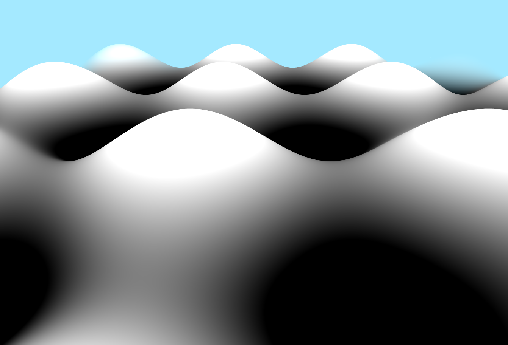
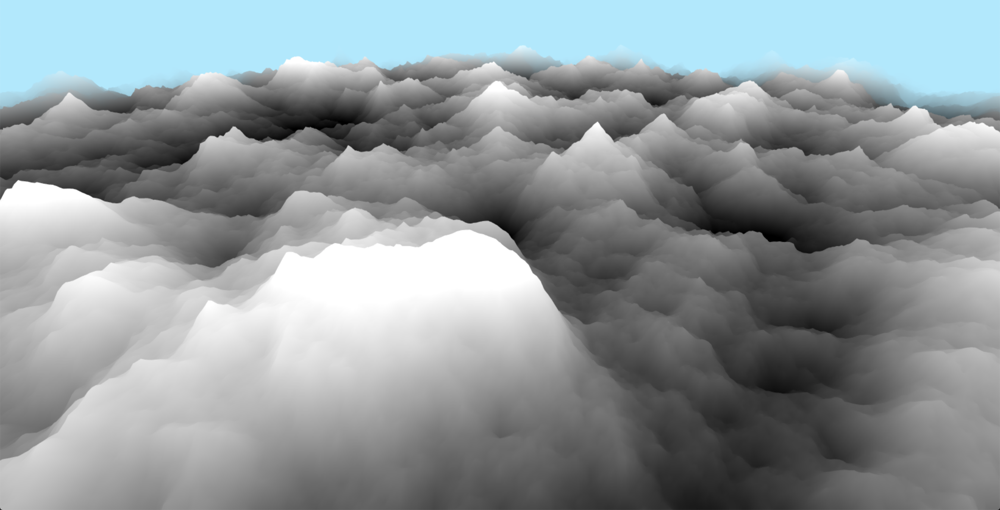
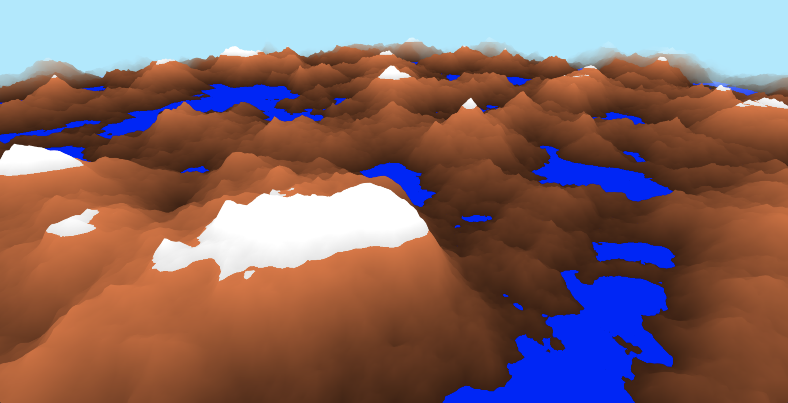
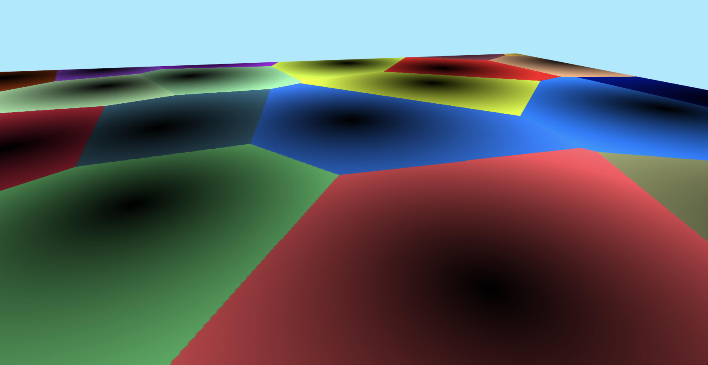

# Procedurally Generated Terrain with WebGl Shaders

By J. Reuben Wetherbee
University of Pennsylvania
Computer Graphics and Game Technology Masters Program
CIS 566 Spring 2019

## Overview
The purpose of this project was to create procedurally generated terrain using a combination of noise functions to
 adjust the height and color of a plane in the WebGl vertex and fragment shaders.  Features of this project include the following:
 - Fractal Brownian Noise (FBM) to generate terrain height
Demo can be viewed [in github pages](https://jrweth.github.io/hw01-noisy-terrain/)

## Basic Setup (non shader code)
- A subdivided plane rendered with a shader that deforms it with a sine curve
and applies a blue distance fog to it to blend it into the background.
- A movable camera 
- A keyboard input listener that listens for the WASD keys
and updates the plane shader representing a 2D position
- A square that spans the range [-1, 1] in X and Y that is rendered as the
"background" of the scene

### Starting Point - Sine Wave Terrain 
The base project uses a 2D mapping of the plane coordinates to height using sine/cosine wave function.  The terrain 
color brightness is then determined by same height field. 

### Using [Fractal Brownian Motion](https://en.wikipedia.org/wiki/Fractional_Brownian_motion) to Specify Height
The first adjustment was to replace the sine/cosine height function with a height function based upon [FBM](https://en.wikipedia.org/wiki/Fractional_Brownian_motion)
in the vertex shader.  Samples were taken iteratively 8 times adjusting the sample length by 50% for each iteration.

### Using Height to determine elevation color
To add more interest to the color, a few simple changes were made to the fragment shader in
order to create elevation based coloration:
- values of highest height were given snow color
- values of medium height were given rock color
- values of low height were given water color and the height was adjusted up to the waterline 

### Determining Normals
In order to determine the normals which to be used by the fragment shader the normal at 
each adjusted plane vertex needed to be determined.  This was done in the vertex shader by
simply calculating the gradient from four neighboring points.  The normal value was then passed to the fragment
shader which used the position of the light source (sun) to adjust the color value via [lambert shading](https://en.wikipedia.org/wiki/Lambertian_reflectance).

### Sun and Moon Transversal 
Since the lambert shading developed in the previous step was based upon the light position, it was then possible to modify this position
over time to create the effect of the sun transversing across the sky over time.  Therefore a uniform time value
was added to the shader program so that the sun position could be calculated.   During the night the base color value was 
adjusted to be nearly grey scale to simulate the moon transversal.  The background color was also adjust to simulate night :vsp
time.

### Separating Terrain into Biomes using [Worley Noise](https://en.wikipedia.org/wiki/Worley_noise)
The next step is to separate terrain into biomes.  This was accomplished by dividing the plane up into a grid, assigning
a random point to each grid, and the using the technique of Worley noise to divide up the plane.

The worley noise map can then be combined with the height terrain to eventually create separate biomes.

### Criteria for selecting Biome type
To simulate different biomes three measures created and distributed across the plane using FBM 
with a very wide sample rate.  The biome divisions determined above were then assigined
a particular biome via a combination of the three measures:

|biome| elevation | moisture | erosion |
|-----| --------- | ---------|---------|
| Monument Valley | low | low | low|
| Dessert | low | low | high|
| Farm Lands | low | high | low |
| Islands | low | high | high |
| Mountain | high | low | low |
| Canyons | high | low | high|
| Forrest | high | high | low |
| Foothills | high | high | high |

#### Mountain Biome
The Mountain Biome adjusted the simple mountains already created and adjusted the equations slightly to create
 additional effects
 
 - Terrain Height
   - Create worley noise with grid radius of 20 to create general mountain ranges and valleys
   - Use exponential function to highlight greatest values `clamp(pow(wNoise + 0.4, 2.0),0.0, 1.0)`
   - Mix Worley noise with FBM noise to create individual mountains `noise = mix(fNoise, wNoise, 0.7)`
   - Use mapping function to raise range and sharpen peaks `height = 0.5 + pow(noise, 3.0) * 3.0`
   
 - Terrain Color
   - Generally color lower elevations as dirt/stone, high as snow
   - alter the stone color between two shades using FBM
   - Perturb the height map so that snow line has more variability
   - adjust the alpha using FBM with time factor to create moveable mist 

